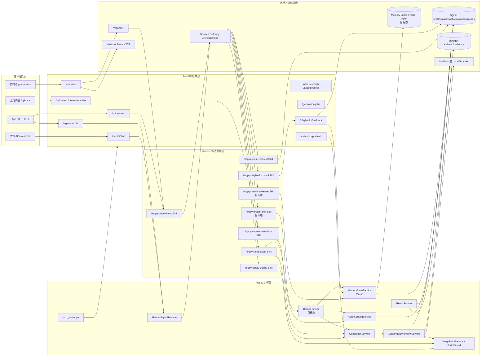
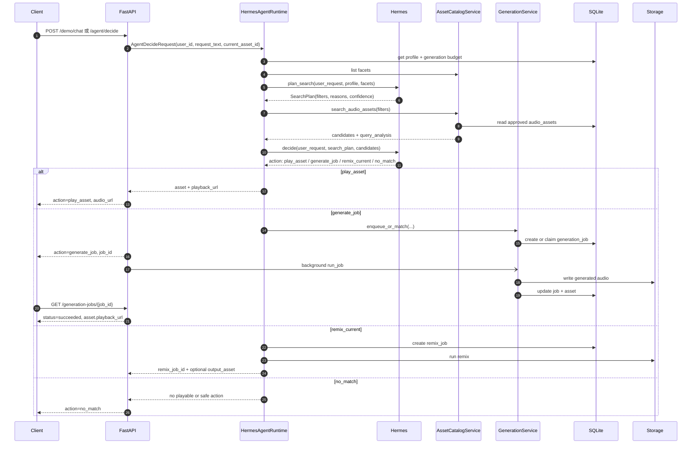
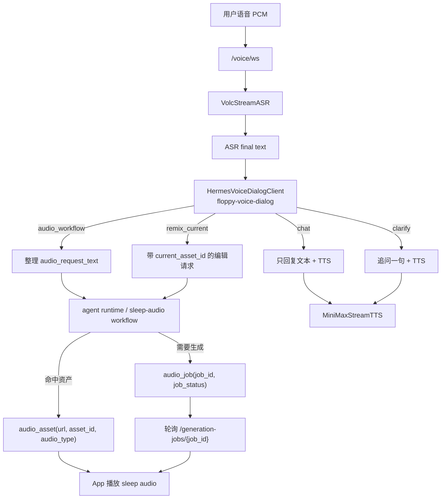
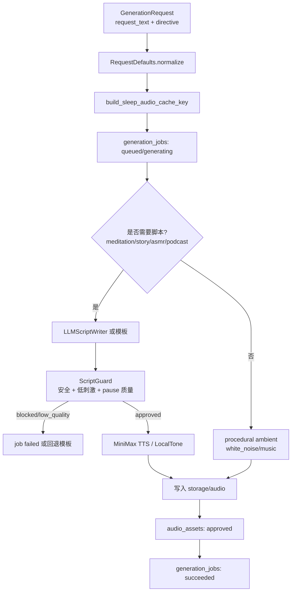
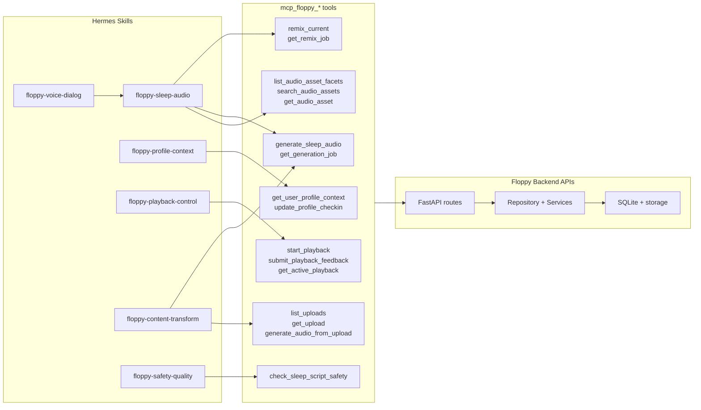
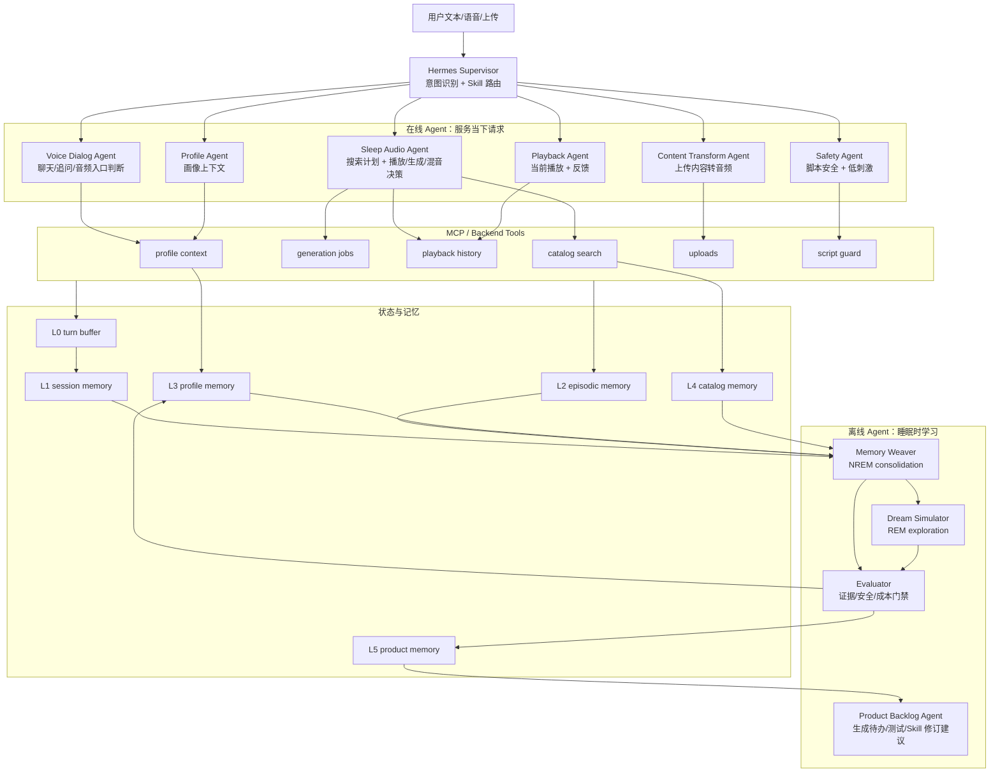
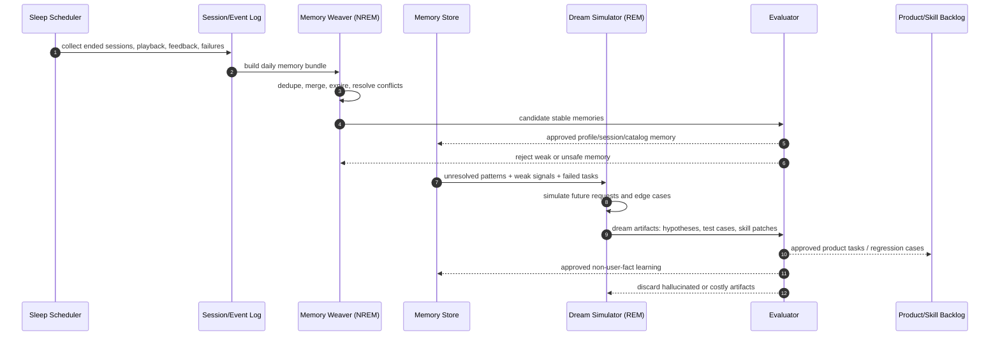
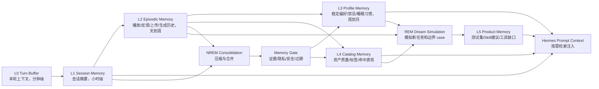
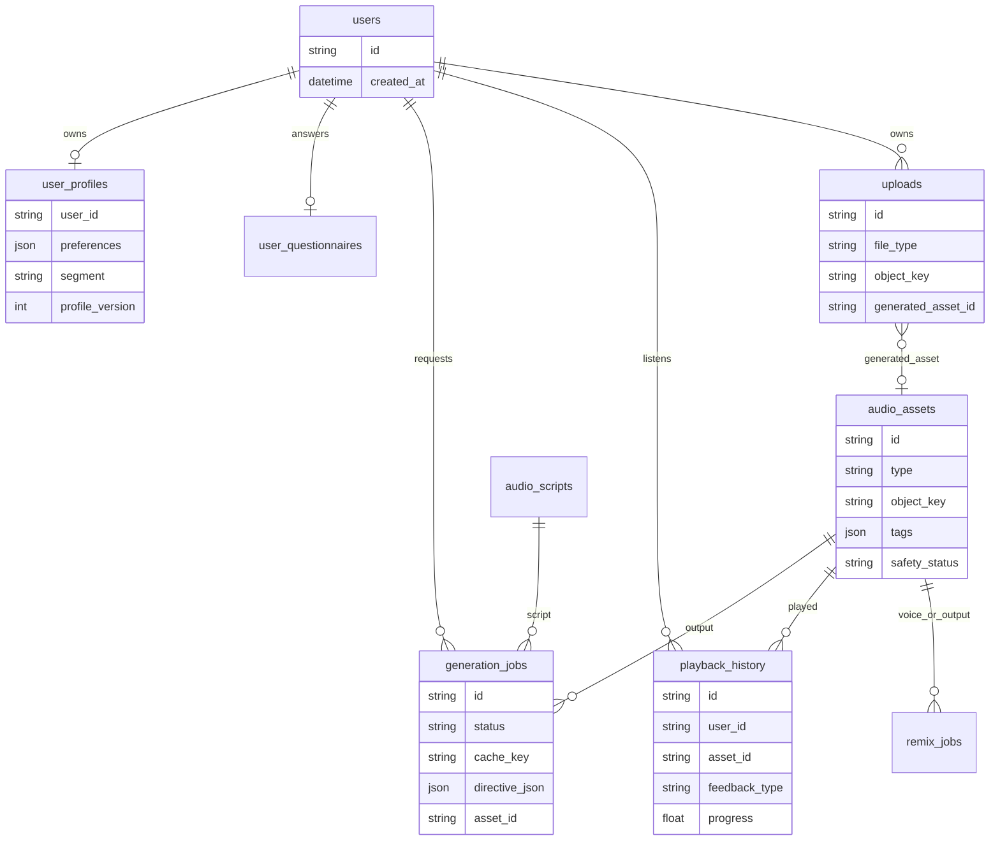

# Floppy 后端与算法流程架构图

本文描述当前 Floppy 后端和算法决策链路，并补充一个目标态的 Multi-Agent、Dream Loop 和多层记忆架构。
当前已经落地的部分以在线请求链路为主；Dream 和多层记忆属于下一阶段产品/算法架构设计。

当前设计原则是：

- Hermes 负责用户意图理解、Skill 路由、结构化检索计划和 workflow 选择。
- Floppy 后端负责 API、资源检索执行、任务状态、预算、安全、存储、播放历史和真实音频生产。
- 资源检索层只执行结构化 filters，不再把中文自然语言硬编码翻译成标签。
- 生成和混音是异步任务，客户端通过 `job_id` 或 `remix_job_id` 轮询结果。
- 目标态里，在线 Agent 只处理当下请求；离线 Dream Loop 在受控预算内整理记忆、发现矛盾、模拟未来请求和生成改进任务。

## 总体分层



## 文本对话与推荐/生成流程



### 关键点

- `plan_search` 是算法侧的第一阶段：把自然语言变成 `type`、`required_tags`、`negative_tags` 等结构化 filters。
- `AssetCatalogService` 是执行器，不做中文语义推断，只做过滤、排序和 URL 补全。
- `decide` 是算法侧的第二阶段：基于候选资产和用户约束选择 `play_asset`、`generate_job`、`remix_current` 或 `no_match`。
- 生成任务不阻塞请求线程。接口先返回 `job_id`，后台执行音频生产。

## 语音入口流程



### 关键点

- 语音入口先走 `floppy-voice-dialog`，不会把“我睡不着”“今天好烦”直接当成推荐请求。
- `audio_workflow` 和 `remix_current` 才会继续进入 sleep-audio workflow。
- `/voice/ws` 会维护本连接的 `current_asset_id`，因此“加点雨声”“换一个”可以作用于当前播放资产。
- 当生成较慢时，WebSocket 返回 `audio_job`，客户端轮询 job，不阻塞整轮语音对话。

## 音频生成工作流



### 关键点

- `GenerationDirective` 由 Hermes 产出并持久化到 job，后台 worker 不会丢失算法意图。
- 人声内容会经过 `ScriptGuard`。白噪音和音乐不走脚本。
- `storage/` 是真实产物目录，保留生成音频、上传文件、日志和 smoke 输出。
- `run_job()` 在 prepare 或 provider 阶段异常时会把 job 标记为 `failed`，避免卡在 `generating`。

## Hermes Skill 与 MCP 工具边界



### 关键点

- Skill 写产品策略和工具调用步骤。
- MCP 工具只是 Floppy 后端 API 的稳定外壳。
- 后端仍然是最终 enforcement boundary：预算、权限、播放反馈归属、安全检查、任务状态和存储路径都在后端校验。

## 目标态：Multi-Agent + Dream Loop + 多层记忆

这个部分是概念架构，借用“睡眠”的类比：

- NREM：整理当天会话，把重复、矛盾、过期的信息合并成稳定记忆。
- REM：让 Agent 自己生成假设场景、没遇到过的请求和边界 case，用来改进 Skill、工具和测试集。
- 梦醒门禁：Dream 产物不能直接污染用户画像，必须经过证据、成本、安全和可解释性检查。

### Multi-Agent 编排



### Hermes Dream Loop



### 多层记忆模式



### 目标态新增职责

| 模块 | 负责什么 | 保护边界 |
| --- | --- | --- |
| `floppy-memory-weaver` | 会话结束后整理短期记忆，合并重复偏好，标记冲突和过期信息 | 不能把单次表达直接写成长期事实 |
| `floppy-dream-loop` | 在空闲窗口模拟未来请求、失败 case、内容缺口和 Skill 改写建议 | Dream 结果默认是候选假设，不直接影响线上决策 |
| `MemoryStoreService` | 管理 L0-L5 记忆读写、TTL、证据计数、隐私过滤 | 所有长期写入必须可追溯到事件证据 |
| `DreamRunner` | 按预算触发 NREM/REM 批处理，记录 token 成本和产物 | 用户活跃、预算不足或安全风险时跳过 |
| `Evaluator` | 审核 Dream 产物是否能进入画像、目录记忆或产品待办 | 拦截幻觉、过拟合、隐私和高刺激内容 |

## 当前数据流与状态



## 当前算法职责拆分

| 模块 | 负责什么 | 不负责什么 |
| --- | --- | --- |
| `floppy-voice-dialog` | 判断语音是聊天、追问、音频请求还是改当前播放 | 不检索资产，不生成音频 |
| `floppy-sleep-audio` | 结构化搜索计划、播放/生成/混音决策 | 不直接写文件，不绕过后端安全/预算 |
| `AssetCatalogService` | 执行 filters、排序候选、回显 query analysis | 不理解中文语义，不做推荐策略 |
| `GenerationService` | job 创建、缓存、预算、后台生成状态 | 不决定用户到底想要什么 |
| `SleepAudioWorkflowService` | 脚本、TTS/环境音、资产入库 | 不做用户对话路由 |
| `ScriptGuard` | 安全、低刺激、停顿质量、成本风险 | 不替代 Hermes 的意图判断 |
| `PlaybackControl` | 播放开始、反馈、active playback、历史记忆 | 不选择内容 |

## 一句话总结

当前在线架构是“薄后端规则 + Hermes 意图判断 + Floppy 强执行边界”。
目标态架构再加一条“离线 Dream Loop + 多层记忆”的学习回路：

```text
用户自然语言
  -> Hermes 识别意图和选择 Skill
  -> Floppy 执行资源检索、生成、混音、安全和状态管理
  -> 客户端播放资产或轮询异步任务

会话结束/低峰窗口
  -> NREM 整理会话、播放反馈和失败任务
  -> REM 模拟未来请求、边界 case 和内容缺口
  -> Evaluator 审核后写入长期记忆、测试集或产品待办
```
